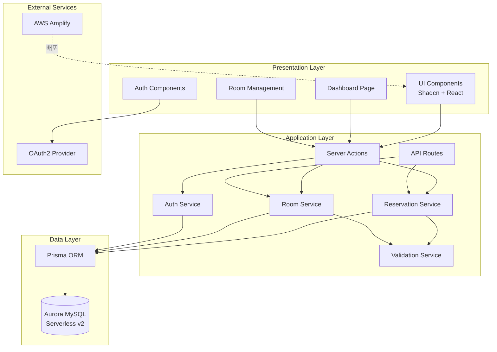

# Design Document

## Overview

본 문서는 사내 회의실 예약 시스템의 기술 설계를 정의합니다. 시스템은 Next.js 15 기반의 풀스택 웹 애플리케이션으로 구현되며, 프론트엔드와 백엔드가 통합된 아키텍처를 채택합니다. Shadcn UI 컴포넌트 라이브러리를 활용하여 일관되고 접근성 높은 사용자 인터페이스를 제공하며, Aurora MySQL Serverless v2를 데이터베이스로 사용하여 확장 가능하고 비용 효율적인 데이터 저장소를 구축합니다.

시스템의 핵심 아키텍처는 3계층 구조를 따르며, Presentation Layer(UI 컴포넌트), Application Layer(비즈니스 로직 및 API), Data Layer(데이터베이스)로 구성됩니다. Next.js의 Server Components와 Server Actions를 활용하여 서버 사이드 렌더링과 클라이언트 사이드 인터랙션을 최적화하고, OAuth2 기반 인증을 통해 보안을 강화합니다. AWS Amplify를 통한 배포로 CI/CD 파이프라인을 자동화하고 운영 효율성을 극대화합니다.

시스템은 실시간 예약 현황 동기화, 동시성 제어를 통한 예약 충돌 방지, 반응형 디자인을 통한 멀티 디바이스 지원을 핵심 설계 원칙으로 삼습니다. 모든 시간 처리는 UTC+9(한국 표준시)를 기준으로 하며, 30분 단위의 시간 슬롯 시스템을 통해 예약 관리의 일관성을 보장합니다. 또한 사용자별 예약 제한, 예약 기간 제한 등의 비즈니스 규칙을 엄격하게 적용하여 회의실 자원의 공평한 분배를 실현합니다.

핵심 설계 원칙:
- **실시간 동기화**: 예약 생성, 수정, 삭제 시 대시보드가 즉시 업데이트되어 모든 사용자가 최신 상태를 확인할 수 있도록 보장
- **동시성 제어**: 데이터베이스 트랜잭션과 낙관적 잠금을 활용하여 동시 예약 요청 시 충돌을 방지하고 데이터 일관성 유지
- **사용자 경험 최적화**: 직관적인 대시보드 인터페이스, 빠른 응답 시간, 명확한 오류 메시지를 통해 사용자 만족도 극대화
- **보안 우선**: OAuth2 기반 인증, 역할 기반 접근 제어(RBAC), 서버 사이드 검증을 통한 다층 보안 체계 구축
- **확장성**: 서버리스 데이터베이스와 Amplify 배포를 통해 사용자 증가에 따른 자동 확장 지원
- **유지보수성**: 명확한 계층 분리, 타입 안정성(TypeScript), 컴포넌트 재사용을 통한 코드 품질 향상

## Architecture

본 시스템은 3계층 아키텍처(3-Tier Architecture)를 채택하며, Next.js 15의 App Router를 활용한 풀스택 구조로 설계됩니다. Presentation Layer는 React Server Components와 Client Components로 구성되어 서버 사이드 렌더링과 클라이언트 인터랙션을 최적화하고, Application Layer는 Server Actions와 API Routes를 통해 비즈니스 로직을 처리하며, Data Layer는 Aurora MySQL Serverless v2와 ORM을 통해 데이터 영속성을 관리합니다.



### Technology Stack

- **프론트엔드**: Next.js 15 (App Router), React 18, TypeScript, Shadcn UI, Tailwind CSS
- **백엔드**: Next.js 15 Server Actions, API Routes, TypeScript
- **데이터베이스**: Aurora MySQL Serverless v2, Prisma ORM
- **인증/인가**: OAuth2, NextAuth.js
- **배포**: AWS Amplify
- **테스팅**: Vitest (Unit), fast-check (Property-Based), Playwright (E2E)
- **기타**: date-fns-tz (시간대 처리), Zod (스키마 검증)

## Components and Interfaces

### 1. Authentication Service

**책임**: 사용자 인증, 세션 관리, 역할 기반 접근 제어

**인터페이스**:
```typescript
// 사용자 역할 정의
enum UserRole {
  USER = 'USER',
  ADMINISTRATOR = 'ADMINISTRATOR'
}

// 인증된 사용자 정보
interface AuthUser {
  id: string;
  email: string;
  name: string;
  role: UserRole;
}

// 인증 서비스 인터페이스
interface AuthService {
  // 현재 인증된 사용자 정보 조회
  getCurrentUser(): Promise<AuthUser | null>;
  
  // 사용자 역할 확인
  hasRole(userId: string, role: UserRole): Promise<boolean>;
  
  // 관리자 권한 확인
  isAdministrator(userId: string): Promise<boolean>;
  
  // 예약 소유권 확인
  isReservationOwner(userId: string, reservationId: string): Promise<boolean>;
}
```

### 2. Room Service

**책임**: 회의실 정보 관리 (생성, 조회, 수정, 삭제)

**인터페이스**:
```typescript
// 회의실 생성 DTO
interface CreateRoomDto {
  name: string;
  capacity: number;
  facilities: string;
}

// 회의실 수정 DTO
interface UpdateRoomDto {
  name?: string;
  capacity?: number;
  facilities?: string;
}

// 회의실 엔티티
interface Room {
  id: string;
  name: string;
  capacity: number;
  facilities: string;
  createdAt: Date;
  updatedAt: Date;
}

// 회의실 서비스 인터페이스
interface RoomService {
  // 모든 회의실 조회
  getAllRooms(): Promise<Room[]>;
  
  // 특정 회의실 조회
  getRoomById(roomId: string): Promise<Room | null>;
  
  // 회의실 생성 (관리자 전용)
  createRoom(data: CreateRoomDto): Promise<Room>;
  
  // 회의실 수정 (관리자 전용)
  updateRoom(roomId: string, data: UpdateRoomDto): Promise<Room>;
  
  // 회의실 삭제 (관리자 전용)
  deleteRoom(roomId: string): Promise<void>;
  
  // 회의실 이름 중복 확인
  isRoomNameExists(name: string, excludeRoomId?: string): Promise<boolean>;
  
  // 회의실에 활성 예약 존재 여부 확인
  hasActiveReservations(roomId: string): Promise<boolean>;
}
```

### 3. Reservation Service

**책임**: 예약 생성, 조회, 수정, 삭제 및 예약 관련 비즈니스 로직 처리

**인터페이스**:
```typescript
// 시간 슬롯 정의
interface TimeSlot {
  startTime: Date;
  endTime: Date;
}

// 예약 생성 DTO
interface CreateReservationDto {
  userId: string;
  roomId: string;
  startTime: Date;
  endTime: Date;
  purpose?: string;
}

// 예약 수정 DTO
interface UpdateReservationDto {
  roomId?: string;
  startTime?: Date;
  endTime?: Date;
  purpose?: string;
}

// 예약 엔티티
interface Reservation {
  id: string;
  userId: string;
  roomId: string;
  startTime: Date;
  endTime: Date;
  purpose: string | null;
  createdAt: Date;
  updatedAt: Date;
  user?: AuthUser;
  room?: Room;
}

// 대시보드 조회용 DTO
interface DashboardQuery {
  date: Date;
}

// 예약 서비스 인터페이스
interface ReservationService {
  // 특정 날짜의 모든 예약 조회
  getReservationsByDate(date: Date): Promise<Reservation[]>;
  
  // 사용자의 모든 활성 예약 조회
  getUserActiveReservations(userId: string): Promise<Reservation[]>;
  
  // 특정 예약 조회
  getReservationById(reservationId: string): Promise<Reservation | null>;
  
  // 예약 생성
  createReservation(data: CreateReservationDto): Promise<Reservation>;
  
  // 예약 수정
  updateReservation(reservationId: string, data: UpdateReservationDto): Promise<Reservation>;
  
  // 예약 삭제
  deleteReservation(reservationId: string): Promise<void>;
  
  // 시간대 예약 가능 여부 확인
  isTimeSlotAvailable(roomId: string, timeSlot: TimeSlot, excludeReservationId?: string): Promise<boolean>;
  
  // 사용자 예약 개수 확인
  getUserReservationCount(userId: string): Promise<number>;
}
```

### 4. Validation Service

**책임**: 예약 및 회의실 데이터 검증, 비즈니스 규칙 적용

**인터페이스**:
```typescript
// 검증 결과
interface ValidationResult {
  isValid: boolean;
  errors: string[];
}

// 예약 검증 규칙
interface ReservationValidationRules {
  minDuration: number; // 최소 30분 (밀리초)
  maxDuration: number; // 최대 2시간 (밀리초)
  operatingHoursStart: number; // 08:00 (시)
  operatingHoursEnd: number; // 20:00 (시)
  maxBookingDays: number; // 30일
  maxReservationsPerUser: number; // 3개
  timeSlotInterval: number; // 30분 (밀리초)
}

// 검증 서비스 인터페이스
interface ValidationService {
  // 예약 시간 검증 (30분 단위, 최소/최대 시간, 운영 시간)
  validateReservationTime(startTime: Date, endTime: Date): ValidationResult;
  
  // 예약 날짜 검증 (예약 가능 기간)
  validateReservationDate(date: Date): ValidationResult;
  
  // 시간대 충돌 검증
  validateTimeSlotConflict(roomId: string, timeSlot: TimeSlot, excludeReservationId?: string): Promise<ValidationResult>;
  
  // 사용자 예약 제한 검증
  validateUserReservationLimit(userId: string): Promise<ValidationResult>;
  
  // 회의실 이름 검증
  validateRoomName(name: string, excludeRoomId?: string): Promise<ValidationResult>;
  
  // 회의실 삭제 가능 여부 검증
  validateRoomDeletion(roomId: string): Promise<ValidationResult>;
}
```

### 5. Dashboard Service

**책임**: 대시보드 데이터 집계 및 제공

**인터페이스**:
```typescript
// 대시보드 데이터
interface DashboardData {
  date: Date;
  rooms: Room[];
  reservations: Reservation[];
  timeSlots: TimeSlot[];
}

// 대시보드 서비스 인터페이스
interface DashboardService {
  // 특정 날짜의 대시보드 데이터 조회
  getDashboardData(date: Date): Promise<DashboardData>;
  
  // 운영 시간 기준 시간 슬롯 생성
  generateTimeSlots(): TimeSlot[];
}
```

## Data Models

### User
```typescript
// Prisma 스키마에서 정의되는 사용자 모델
interface User {
  id: string;
  email: string;
  name: string;
  role: UserRole;
  createdAt: Date;
  updatedAt: Date;
  reservations: Reservation[];
}
```

### Room
```typescript
// 회의실 모델
interface Room {
  id: string;
  name: string;
  capacity: number;
  facilities: string;
  createdAt: Date;
  updatedAt: Date;
  reservations: Reservation[];
}
```

### Reservation
```typescript
// 예약 모델
interface Reservation {
  id: string;
  userId: string;
  roomId: string;
  startTime: Date;
  endTime: Date;
  purpose: string | null;
  createdAt: Date;
  updatedAt: Date;
  user: User;
  room: Room;
}
```

### Database Schema

```sql
-- Users 테이블
CREATE TABLE users (
  id VARCHAR(36) PRIMARY KEY,
  email VARCHAR(255) NOT NULL UNIQUE,
  name VARCHAR(255) NOT NULL,
  role ENUM('USER', 'ADMINISTRATOR') NOT NULL DEFAULT 'USER',
  created_at TIMESTAMP NOT NULL DEFAULT CURRENT_TIMESTAMP,
  updated_at TIMESTAMP NOT NULL DEFAULT CURRENT_TIMESTAMP ON UPDATE CURRENT_TIMESTAMP,
  INDEX idx_email (email),
  INDEX idx_role (role)
) ENGINE=InnoDB DEFAULT CHARSET=utf8mb4 COLLATE=utf8mb4_unicode_ci;

-- Rooms 테이블
CREATE TABLE rooms (
  id VARCHAR(36) PRIMARY KEY,
  name VARCHAR(255) NOT NULL UNIQUE,
  capacity INT NOT NULL,
  facilities TEXT NOT NULL,
  created_at TIMESTAMP NOT NULL DEFAULT CURRENT_TIMESTAMP,
  updated_at TIMESTAMP NOT NULL DEFAULT CURRENT_TIMESTAMP ON UPDATE CURRENT_TIMESTAMP,
  INDEX idx_name (name)
) ENGINE=InnoDB DEFAULT CHARSET=utf8mb4 COLLATE=utf8mb4_unicode_ci;

-- Reservations 테이블
CREATE TABLE reservations (
  id VARCHAR(36) PRIMARY KEY,
  user_id VARCHAR(36) NOT NULL,
  room_id VARCHAR(36) NOT NULL,
  start_time TIMESTAMP NOT NULL,
  end_time TIMESTAMP NOT NULL,
  purpose TEXT,
  created_at TIMESTAMP NOT NULL DEFAULT CURRENT_TIMESTAMP,
  updated_at TIMESTAMP NOT NULL DEFAULT CURRENT_TIMESTAMP ON UPDATE CURRENT_TIMESTAMP,
  FOREIGN KEY (user_id) REFERENCES users(id) ON DELETE CASCADE,
  FOREIGN KEY (room_id) REFERENCES rooms(id) ON DELETE RESTRICT,
  INDEX idx_user_id (user_id),
  INDEX idx_room_id (room_id),
  INDEX idx_start_time (start_time),
  INDEX idx_end_time (end_time),
  INDEX idx_room_time (room_id, start_time, end_time),
  CONSTRAINT chk_time_order CHECK (start_time < end_time)
) ENGINE=InnoDB DEFAULT CHARSET=utf8mb4 COLLATE=utf8mb4_unicode_ci;
```

### Prisma Schema

```prisma
// schema.prisma
generator client {
  provider = "prisma-client-js"
}

datasource db {
  provider = "mysql"
  url      = env("DATABASE_URL")
}

enum UserRole {
  USER
  ADMINISTRATOR
}

model User {
  id           String        @id @default(uuid())
  email        String        @unique
  name         String
  role         UserRole      @default(USER)
  createdAt    DateTime      @default(now()) @map("created_at")
  updatedAt    DateTime      @updatedAt @map("updated_at")
  reservations Reservation[]

  @@index([email])
  @@index([role])
  @@map("users")
}

model Room {
  id           String        @id @default(uuid())
  name         String        @unique
  capacity     Int
  facilities   String        @db.Text
  createdAt    DateTime      @default(now()) @map("created_at")
  updatedAt    DateTime      @updatedAt @map("updated_at")
  reservations Reservation[]

  @@index([name])
  @@map("rooms")
}

model Reservation {
  id        String   @id @default(uuid())
  userId    String   @map("user_id")
  roomId    String   @map("room_id")
  startTime DateTime @map("start_time")
  endTime   DateTime @map("end_time")
  purpose   String?  @db.Text
  createdAt DateTime @default(now()) @map("created_at")
  updatedAt DateTime @updatedAt @map("updated_at")

  user User @relation(fields: [userId], references: [id], onDelete: Cascade)
  room Room @relation(fields: [roomId], references: [id], onDelete: Restrict)

  @@index([userId])
  @@index([roomId])
  @@index([startTime])
  @@index([endTime])
  @@index([roomId, startTime, endTime])
  @@map("reservations")
}
```

## Correctness Properties

*속성(Property)은 시스템의 모든 유효한 실행에서 참이어야 하는 특성 또는 동작입니다. 속성은 사람이 읽을 수 있는 명세와 기계가 검증 가능한 정확성 보장 사이의 다리 역할을 합니다.*

### Property 1: 대시보드 데이터 일관성
*모든* 대시보드 조회 요청에 대해, 시스템은 해당 날짜의 모든 회의실과 예약 정보를 정확하게 반환해야 하며, 30분 단위의 시간 슬롯은 운영 시간(08:00~20:00) 내에서만 생성되어야 합니다.
**Validates: Requirements 1.1, 1.2, 1.3, 1.4, 1.5, 1.6, 1.7**

### Property 2: 날짜 선택 제약
*모든* 날짜 선택 요청에 대해, 시스템은 현재 날짜(UTC+9 기준)로부터 0일 이상 30일 이하의 날짜만 허용해야 하며, 범위를 벗어난 날짜는 거부되어야 합니다.
**Validates: Requirements 2.3, 2.4, 16.4**

### Property 3: 예약 시간 검증
*모든* 예약 생성 및 수정 요청에 대해, 시스템은 시작 시간과 종료 시간이 30분 단위로 정렬되어 있고, 예약 시간이 최소 30분 이상 최대 2시간 이하이며, 운영 시간(08:00~20:00) 내에 있는지 검증해야 합니다.
**Validates: Requirements 3.5, 3.6, 3.7, 3.8, 3.9, 3.10**

### Property 4: 예약 충돌 방지
*모든* 예약 생성 및 수정 요청에 대해, 시스템은 동일한 회의실의 요청된 시간대에 기존 예약이 존재하는지 확인해야 하며, 시간대가 겹치는 경우(시작 시간 또는 종료 시간이 겹치는 모든 경우 포함) 요청을 거부해야 합니다.
**Validates: Requirements 7.1, 7.2, 7.3, 7.4**

### Property 5: 사용자 예약 제한
*모든* 예약 생성 요청에 대해, 시스템은 요청 사용자의 현재 활성 예약 개수(현재 시간 이후의 예약)를 확인해야 하며, 3개 이상인 경우 새로운 예약 생성을 거부해야 합니다.
**Validates: Requirements 6.1, 6.2, 6.3, 6.4**

### Property 6: 예약 소유권 검증
*모든* 예약 수정 및 삭제 요청에 대해, 시스템은 요청 사용자가 해당 예약의 소유자이거나 관리자 역할을 가진 경우에만 작업을 허용해야 하며, 그렇지 않은 경우 권한 오류를 반환해야 합니다.
**Validates: Requirements 4.6, 5.4, 9.5, 14.4**

### Property 7: 예약 생성 후 상태 반영
*모든* 성공적인 예약 생성, 수정, 삭제 작업 후, 시스템은 데이터베이스에 변경 사항을 영속화해야 하며, 이후 조회 시 변경된 상태가 정확하게 반환되어야 합니다.
**Validates: Requirements 3.3, 3.4, 4.3, 4.4, 5.2, 5.3**

### Property 8: 회의실 이름 유일성
*모든* 회의실 생성 및 수정 요청에 대해, 시스템은 동일한 이름의 회의실이 이미 존재하는지 확인해야 하며, 중복된 이름인 경우 요청을 거부해야 합니다.
**Validates: Requirements 10.6, 10.7, 11.5, 11.6**

### Property 9: 회의실 삭제 제약
*모든* 회의실 삭제 요청에 대해, 시스템은 해당 회의실에 미래의 활성 예약(현재 시간 이후의 예약)이 존재하는지 확인해야 하며, 존재하는 경우 삭제를 거부하고 예약 개수를 포함한 경고 메시지를 반환해야 합니다.
**Validates: Requirements 12.2, 12.3, 12.5, 12.6**

### Property 10: 관리자 권한 검증
*모든* 회의실 생성, 수정, 삭제 요청 및 타 사용자 예약 관리 요청에 대해, 시스템은 요청 사용자가 관리자 역할을 가진 경우에만 작업을 허용해야 하며, 일반 사용자인 경우 권한 오류를 반환해야 합니다.
**Validates: Requirements 14.2, 14.3, 14.5**

### Property 11: 인증 필수
*모든* 시스템 기능 접근 요청에 대해, 시스템은 유효한 인증 세션이 존재하는지 확인해야 하며, 인증되지 않은 요청은 거부되어야 합니다.
**Validates: Requirements 13.1, 13.2, 13.3**

### Property 12: 역할 식별
*모든* 인증 성공 후, 시스템은 사용자의 역할(USER 또는 ADMINISTRATOR)을 정확하게 식별하고 세션에 저장해야 하며, 이후 모든 권한 검증에서 이 역할 정보를 사용해야 합니다.
**Validates: Requirements 13.4, 14.1**

### Property 13: 시간대 일관성
*모든* 날짜 및 시간 처리에 대해, 시스템은 UTC+9 시간대를 기준으로 계산하고 표시해야 하며, 현재 시간 판단, 예약 가능 기간 계산, 활성 예약 판단 등 모든 시간 관련 로직에서 일관되게 적용되어야 합니다.
**Validates: Requirements 16.1, 16.2, 16.3, 16.4**

### Property 14: 트랜잭션 원자성
*모든* 예약 생성, 수정, 삭제 작업에 대해, 시스템은 데이터베이스 트랜잭션을 사용하여 작업의 원자성을 보장해야 하며, 작업 중 오류 발생 시 모든 변경 사항이 롤백되어야 합니다.
**Validates: Requirements 3.3, 4.3, 5.2, 10.3, 11.3, 12.3**

### Property 15: 입력 데이터 검증
*모든* 사용자 입력에 대해, 시스템은 서버 사이드에서 데이터 타입, 형식, 범위, 필수 필드 등을 검증해야 하며, 유효하지 않은 입력은 명확한 오류 메시지와 함께 거부되어야 합니다.
**Validates: Requirements 3.2, 4.2, 10.2, 11.2**

## Error Handling

### Error Categories

1. **Validation Errors (400 Bad Request)**
   - 예약 시간이 30분 단위가 아닌 경우
   - 예약 시간이 최소/최대 범위를 벗어난 경우
   - 예약 시간이 운영 시간을 벗어난 경우
   - 예약 날짜가 예약 가능 기간을 벗어난 경우
   - 필수 필드 누락
   - 잘못된 데이터 형식
   - Response: `400 Bad Request`

2. **Authentication Errors (401 Unauthorized)**
   - 인증 세션이 없는 경우
   - 인증 토큰이 만료된 경우
   - 유효하지 않은 인증 정보
   - Response: `401 Unauthorized`

3. **Authorization Errors (403 Forbidden)**
   - 일반 사용자가 관리자 기능에 접근하는 경우
   - 다른 사용자의 예약을 수정/삭제하려는 경우
   - 권한이 없는 작업 시도
   - Response: `403 Forbidden`

4. **Not Found Errors (404 Not Found)**
   - 존재하지 않는 예약 ID
   - 존재하지 않는 회의실 ID
   - 존재하지 않는 사용자 ID
   - Response: `404 Not Found`

5. **Conflict Errors (409 Conflict)**
   - 예약 시간대 충돌
   - 회의실 이름 중복
   - 사용자 예약 개수 제한 초과
   - 활성 예약이 있는 회의실 삭제 시도
   - Response: `409 Conflict`

6. **Server Errors (500 Internal Server Error)**
   - 데이터베이스 연결 오류
   - 예상치 못한 서버 오류
   - 트랜잭션 실패
   - Response: `500 Internal Server Error`

### Error Response Format

```typescript
// 표준 오류 응답 구조
interface ErrorResponse {
  error: {
    code: string;
    message: string;
    details?: Record<string, string[]>;
    timestamp: string;
  };
}

// 오류 코드 정의
enum ErrorCode {
  // Validation Errors
  INVALID_TIME_SLOT = 'INVALID_TIME_SLOT',
  INVALID_DURATION = 'INVALID_DURATION',
  INVALID_OPERATING_HOURS = 'INVALID_OPERATING_HOURS',
  INVALID_BOOKING_PERIOD = 'INVALID_BOOKING_PERIOD',
  VALIDATION_FAILED = 'VALIDATION_FAILED',
  
  // Authentication Errors
  UNAUTHORIZED = 'UNAUTHORIZED',
  INVALID_CREDENTIALS = 'INVALID_CREDENTIALS',
  SESSION_EXPIRED = 'SESSION_EXPIRED',
  
  // Authorization Errors
  FORBIDDEN = 'FORBIDDEN',
  INSUFFICIENT_PERMISSIONS = 'INSUFFICIENT_PERMISSIONS',
  NOT_OWNER = 'NOT_OWNER',
  
  // Not Found Errors
  RESERVATION_NOT_FOUND = 'RESERVATION_NOT_FOUND',
  ROOM_NOT_FOUND = 'ROOM_NOT_FOUND',
  USER_NOT_FOUND = 'USER_NOT_FOUND',
  
  // Conflict Errors
  TIME_SLOT_CONFLICT = 'TIME_SLOT_CONFLICT',
  ROOM_NAME_DUPLICATE = 'ROOM_NAME_DUPLICATE',
  RESERVATION_LIMIT_EXCEEDED = 'RESERVATION_LIMIT_EXCEEDED',
  ROOM_HAS_ACTIVE_RESERVATIONS = 'ROOM_HAS_ACTIVE_RESERVATIONS',
  
  // Server Errors
  INTERNAL_SERVER_ERROR = 'INTERNAL_SERVER_ERROR',
  DATABASE_ERROR = 'DATABASE_ERROR',
  TRANSACTION_FAILED = 'TRANSACTION_FAILED'
}

// 오류 응답 생성 헬퍼
function createErrorResponse(
  code: ErrorCode,
  message: string,
  details?: Record<string, string[]>
): ErrorResponse {
  return {
    error: {
      code,
      message,
      details,
      timestamp: new Date().toISOString()
    }
  };
}
```

### Error Handling Strategy

- **클라이언트 사이드 검증**: Zod 스키마를 사용한 폼 입력 검증으로 불필요한 서버 요청 최소화
- **서버 사이드 검증**: 모든 입력에 대해 서버에서 재검증하여 보안 강화
- **트랜잭션 관리**: Prisma 트랜잭션을 사용하여 데이터 일관성 보장 및 오류 시 자동 롤백
- **낙관적 잠금**: 동시성 제어를 위해 버전 필드 또는 타임스탬프 기반 충돌 감지
- **명확한 오류 메시지**: 사용자가 이해할 수 있는 한국어 오류 메시지 제공
- **로깅**: 모든 오류를 구조화된 로그로 기록하여 디버깅 및 모니터링 지원
- **재시도 로직**: 일시적 네트워크 오류에 대한 자동 재시도 (최대 3회)
- **사용자 피드백**: Toast 알림을 통한 즉각적인 오류 피드백 제공

## Testing Strategy

### Unit Testing

단위 테스트는 Vitest를 사용하여 각 서비스와 유틸리티 함수의 독립적인 동작을 검증합니다. 모든 비즈니스 로직은 격리된 환경에서 테스트되며, 외부 의존성은 모킹됩니다.

- **Validation Service**: 시간 검증, 날짜 검증, 충돌 검증 로직
- **Reservation Service**: 예약 CRUD 작업, 가용성 확인, 사용자 예약 개수 계산
- **Room Service**: 회의실 CRUD 작업, 이름 중복 확인, 활성 예약 확인
- **Auth Service**: 권한 확인, 역할 검증, 소유권 확인
- **Dashboard Service**: 시간 슬롯 생성, 데이터 집계
- **Time Utilities**: UTC+9 시간대 변환, 30분 단위 정렬, 시간 범위 계산

예시 단위 테스트:
- 30분 단위가 아닌 시간으로 예약 생성 시 검증 실패
- 최소 시간(30분) 미만 예약 생성 시 검증 실패
- 최대 시간(2시간) 초과 예약 생성 시 검증 실패
- 운영 시간(08:00~20:00) 외 예약 생성 시 검증 실패
- 예약 가능 기간(0~30일) 외 날짜 선택 시 검증 실패
- 시간대 겹침 감지 로직 (시작/종료 시간 모든 경우)
- 사용자 예약 개수가 3개일 때 추가 예약 거부
- 관리자가 아닌 사용자의 관리 기능 접근 거부
- 예약 소유자가 아닌 사용자의 수정/삭제 거부
- 활성 예약이 있는 회의실 삭제 거부
- 회의실 이름 중복 시 생성/수정 거부

### Property-Based Testing

속성 기반 테스트는 fast-check 라이브러리를 사용하여 다양한 무작위 입력에 대해 시스템의 불변 속성을 검증합니다. 각 속성 테스트는 설계 문서의 Correctness Properties와 1:1 매핑됩니다.

**Configuration**:
- 각 속성 테스트는 최소 100회 반복 실행 (기본값)
- 복잡하거나 중요한 속성(예: 동시성 제어, 충돌 감지)은 200회 반복 실행
- 각 테스트는 검증하는 속성 번호를 주석으로 명시
- 태그 형식: `// Feature: [기능명], Property {번호}: {속성 설명}`

**Property Test Coverage**:

1. **Property 1 (대시보드 데이터 일관성)**: 무작위 날짜에 대해 대시보드 조회 시 모든 회의실과 예약이 반환되고, 시간 슬롯이 08:00~20:00 범위 내 30분 단위로 생성되는지 검증
   ```typescript
   // Feature: Dashboard, Property 1: 대시보드 데이터 일관성
   fc.assert(
     fc.property(
       fc.date({ min: new Date(), max: addDays(new Date(), 30) }),
       async (date) => {
         const data = await getDashboardData(date);
         // 모든 회의실 반환 확인
         expect(data.rooms.length).toBeGreaterThan(0);
         // 시간 슬롯이 30분 단위인지 확인
         data.timeSlots.forEach(slot => {
           expect(slot.startTime.getMinutes() % 30).toBe(0);
           expect(slot.endTime.getMinutes() % 30).toBe(0);
         });
         // 운영 시간 범위 확인
         expect(data.timeSlots[0].startTime.getHours()).toBe(8);
         expect(data.timeSlots[data.timeSlots.length - 1].endTime.getHours()).toBe(20);
       }
     ),
     { numRuns: 100 }
   );
   ```

2. **Property 2 (날짜 선택 제약)**: 무작위 날짜에 대해 0~30일 범위 내 날짜는 허용되고, 범위 외 날짜는 거부되는지 검증
   ```typescript
   // Feature: Dashboard, Property 2: 날짜 선택 제약
   fc.assert(
     fc.property(
       fc.integer({ min: -100, max: 100 }),
       async (daysOffset) => {
         const date = addDays(new Date(), daysOffset);
         const result = await validateReservationDate(date);
         if (daysOffset >= 0 && daysOffset <= 30) {
           expect(result.isValid).toBe(true);
         } else {
           expect(result.isValid).toBe(false);
         }
       }
     ),
     { numRuns: 100 }
   );
   ```

3. **Property 3 (예약 시간 검증)**: 무작위 시작/종료 시간에 대해 30분 단위, 최소/최대 시간, 운영 시간 검증이 올바르게 작동하는지 확인
   ```typescript
   // Feature: Reservation, Property 3: 예약 시간 검증
   fc.assert(
     fc.property(
       fc.integer({ min: 0, max: 23 }),
       fc.integer({ min: 0, max: 59 }),
       fc.integer({ min: 30, max: 240 }),
       async (startHour, startMinute, durationMinutes) => {
         const startTime = new Date();
         startTime.setHours(startHour, startMinute, 0, 0);
         const endTime = addMinutes(startTime, durationMinutes);
         
         const result = await validateReservationTime(startTime, endTime);
         
         const is30MinAligned = startMinute % 30 === 0;
         const isValidDuration = durationMinutes >= 30 && durationMinutes <= 120;
         const isWithinOperatingHours = startHour >= 8 && startHour < 20 && endTime.getHours() <= 20;
         
         if (is30MinAligned && isValidDuration && isWithinOperatingHours) {
           expect(result.isValid).toBe(true);
         } else {
           expect(result.isValid).toBe(false);
         }
       }
     ),
     { numRuns: 200 }
   );
   ```

4. **Property 4 (예약 충돌 방지)**: 무작위 예약 시간대에 대해 겹치는 예약이 있으면 거부되고, 없으면 허용되는지 검증
   ```typescript
   // Feature: Reservation, Property 4: 예약 충돌 방지
   fc.assert(
     fc.property(
       fc.uuid(),
       fc.date(),
       fc.integer({ min: 30, max: 120 }),
       async (roomId, startTime, durationMinutes) => {
         const endTime = addMinutes(startTime, durationMinutes);
         const hasConflict = await hasTimeSlotConflict(roomId, { startTime, endTime });
         const result = await validateTimeSlotConflict(roomId, { startTime, endTime });
         
         if (hasConflict) {
           expect(result.isValid).toBe(false);
         } else {
           expect(result.isValid).toBe(true);
         }
       }
     ),
     { numRuns: 200 }
   );
   ```

5. **Property 5 (사용자 예약 제한)**: 무작위 사용자에 대해 활성 예약이 3개 미만이면 허용되고, 3개 이상이면 거부되는지 검증
   ```typescript
   // Feature: Reservation, Property 5: 사용자 예약 제한
   fc.assert(
     fc.property(
       fc.uuid(),
       async (userId) => {
         const count = await getUserReservationCount(userId);
         const result = await validateUserReservationLimit(userId);
         
         if (count < 3) {
           expect(result.isValid).toBe(true);
         } else {
           expect(result.isValid).toBe(false);
         }
       }
     ),
     { numRuns: 100 }
   );
   ```

6. **Property 6 (예약 소유권 검증)**: 무작위 사용자와 예약에 대해 소유자 또는 관리자만 수정/삭제 가능한지 검증
   ```typescript
   // Feature: Authorization, Property 6: 예약 소유권 검증
   fc.assert(
     fc.property(
       fc.uuid(),
       fc.uuid(),
       fc.constantFrom(UserRole.USER, UserRole.ADMINISTRATOR),
       async (userId, reservationId, role) => {
         const isOwner = await isReservationOwner(userId, reservationId);
         const isAdmin = role === UserRole.ADMINISTRATOR;
         const canModify = isOwner || isAdmin;
         
         // 실제 수정 시도
         const result = await attemptReservationModification(userId, reservationId);
         
         if (canModify) {
           expect(result.success).toBe(true);
         } else {
           expect(result.success).toBe(false);
           expect(result.error?.code).toBe(ErrorCode.FORBIDDEN);
         }
       }
     ),
     { numRuns: 100 }
   );
   ```

7. **Property 7 (예약 생성 후 상태 반영)**: 무작위 예약 데이터로 생성 후 조회 시 동일한 데이터가 반환되는지 검증
   ```typescript
   // Feature: Reservation, Property 7: 예약 생성 후 상태 반영
   fc.assert(
     fc.property(
       fc.record({
         userId: fc.uuid(),
         roomId: fc.uuid(),
         startTime: fc.date(),
         endTime: fc.date(),
         purpose: fc.option(fc.string(), { nil: null })
       }),
       async (reservationData) => {
         const created = await createReservation(reservationData);
         const retrieved = await getReservationById(created.id);
         
         expect(retrieved).not.toBeNull();
         expect(retrieved?.userId).toBe(reservationData.userId);
         expect(retrieved?.roomId).toBe(reservationData.roomId);
         expect(retrieved?.startTime).toEqual(reservationData.startTime);
         expect(retrieved?.endTime).toEqual(reservationData.endTime);
       }
     ),
     { numRuns: 100 }
   );
   ```

8. **Property 8 (회의실 이름 유일성)**: 무작위 회의실 이름에 대해 중복 시 생성/수정이 거부되는지 검증
   ```typescript
   // Feature: Room, Property 8: 회의실 이름 유일성
   fc.assert(
     fc.property(
       fc.string({ minLength: 1, maxLength: 50 }),
       async (roomName) => {
         const exists = await isRoomNameExists(roomName);
         const result = await validateRoomName(roomName);
         
         if (exists) {
           expect(result.isValid).toBe(false);
           expect(result.errors).toContain('중복된 회의실 이름');
         } else {
           expect(result.isValid).toBe(true);
         }
       }
     ),
     { numRuns: 100 }
   );
   ```

9. **Property 9 (회의실 삭제 제약)**: 무작위 회의실에 대해 활성 예약이 있으면 삭제가 거부되는지 검증
   ```typescript
   // Feature: Room, Property 9: 회의실 삭제 제약
   fc.assert(
     fc.property(
       fc.uuid(),
       async (roomId) => {
         const hasActive = await hasActiveReservations(roomId);
         const result = await validateRoomDeletion(roomId);
         
         if (hasActive) {
           expect(result.isValid).toBe(false);
           expect(result.errors[0]).toContain('활성 예약');
         } else {
           expect(result.isValid).toBe(true);
         }
       }
     ),
     { numRuns: 100 }
   );
   ```

10. **Property 10 (관리자 권한 검증)**: 무작위 사용자 역할에 대해 관리자만 관리 기능에 접근 가능한지 검증
    ```typescript
    // Feature: Authorization, Property 10: 관리자 권한 검증
    fc.assert(
      fc.property(
        fc.uuid(),
        fc.constantFrom(UserRole.USER, UserRole.ADMINISTRATOR),
        async (userId, role) => {
          const isAdmin = role === UserRole.ADMINISTRATOR;
          const result = await attemptAdminOperation(userId);
          
          if (isAdmin) {
            expect(result.success).toBe(true);
          } else {
            expect(result.success).toBe(false);
            expect(result.error?.code).toBe(ErrorCode.FORBIDDEN);
          }
        }
      ),
      { numRuns: 100 }
    );
    ```

11. **Property 11 (인증 필수)**: 무작위 요청에 대해 인증 세션이 없으면 거부되는지 검증
    ```typescript
    // Feature: Authentication, Property 11: 인증 필수
    fc.assert(
      fc.property(
        fc.boolean(),
        async (hasSession) => {
          const result = await attemptProtectedOperation(hasSession ? mockSession : null);
          
          if (hasSession) {
            expect(result.success).toBe(true);
          } else {
            expect(result.success).toBe(false);
            expect(result.error?.code).toBe(ErrorCode.UNAUTHORIZED);
          }
        }
      ),
      { numRuns: 100 }
    );
    ```

12. **Property 12 (역할 식별)**: 무작위 사용자에 대해 인증 후 역할이 정확하게 식별되는지 검증
    ```typescript
    // Feature: Authentication, Property 12: 역할 식별
    fc.assert(
      fc.property(
        fc.record({
          id: fc.uuid(),
          email: fc.emailAddress(),
          name: fc.string(),
          role: fc.constantFrom(UserRole.USER, UserRole.ADMINISTRATOR)
        }),
        async (userData) => {
          const session = await authenticateUser(userData);
          
          expect(session.user.role).toBe(userData.role);
          expect(await hasRole(userData.id, userData.role)).toBe(true);
        }
      ),
      { numRuns: 100 }
    );
    ```

13. **Property 13 (시간대 일관성)**: 무작위 날짜/시간에 대해 모든 시간 처리가 UTC+9 기준으로 일관되게 작동하는지 검증
    ```typescript
    // Feature: Timezone, Property 13: 시간대 일관성
    fc.assert(
      fc.property(
        fc.date(),
        async (date) => {
          const kstDate = toKST(date);
          const bookingPeriod = calculateBookingPeriod(kstDate);
          const isActive = isReservationActive(kstDate);
          
          // 모든 시간 계산이 UTC+9 기준인지 확인
          expect(kstDate.getTimezoneOffset()).toBe(-540); // UTC+9 = -540분
          expect(bookingPeriod.start.getTimezoneOffset()).toBe(-540);
          expect(bookingPeriod.end.getTimezoneOffset()).toBe(-540);
        }
      ),
      { numRuns: 100 }
    );
    ```

14. **Property 14 (트랜잭션 원자성)**: 무작위 예약 작업에서 오류 발생 시 모든 변경이 롤백되는지 검증
    ```typescript
    // Feature: Transaction, Property 14: 트랜잭션 원자성
    fc.assert(
      fc.property(
        fc.record({
          userId: fc.uuid(),
          roomId: fc.uuid(),
          startTime: fc.date(),
          endTime: fc.date()
        }),
        fc.boolean(),
        async (reservationData, shouldFail) => {
          const beforeCount = await getReservationCount();
          
          try {
            if (shouldFail) {
              // 의도적으로 실패하는 작업
              await createReservationWithError(reservationData);
            } else {
              await createReservation(reservationData);
            }
          } catch (error) {
            // 오류 발생 시 롤백 확인
            const afterCount = await getReservationCount();
            expect(afterCount).toBe(beforeCount);
          }
        }
      ),
      { numRuns: 100 }
    );
    ```

15. **Property 15 (입력 데이터 검증)**: 무작위 입력에 대해 서버 사이드 검증이 올바르게 작동하는지 확인
    ```typescript
    // Feature: Validation, Property 15: 입력 데이터 검증
    fc.assert(
      fc.property(
        fc.record({
          userId: fc.option(fc.uuid(), { nil: undefined }),
          roomId: fc.option(fc.uuid(), { nil: undefined }),
          startTime: fc.option(fc.date(), { nil: undefined }),
          endTime: fc.option(fc.date(), { nil: undefined })
        }),
        async (input) => {
          const result = await validateReservationInput(input);
          
          const hasAllRequired = input.userId && input.roomId && input.startTime && input.endTime;
          
          if (hasAllRequired) {
            expect(result.isValid).toBe(true);
          } else {
            expect(result.isValid).toBe(false);
            expect(result.errors.length).toBeGreaterThan(0);
          }
        }
      ),
      { numRuns: 100 }
    );
    ```

### Integration Testing

통합 테스트는 Playwright를 사용하여 실제 브라우저 환경에서 엔드투엔드 시나리오를 검증합니다. 사용자 관점에서 전체 워크플로우가 올바르게 작동하는지 확인합니다.

**주요 통합 테스트 시나리오**:

- **사용자 인증 플로우**
  - OAuth2 로그인 프로세스
  - 세션 유지 및 만료 처리
  - 로그아웃 후 보호된 페이지 접근 차단

- **대시보드 조회 플로우**
  - 대시보드 로드 시 모든 회의실 표시
  - 날짜 선택 시 예약 현황 업데이트
  - 30분 단위 시간 슬롯 표시
  - 예약 가능/불가능 상태 시각적 구분

- **예약 생성 플로우**
  - 빈 시간대 클릭 → 예약 폼 표시
  - 예약 정보 입력 및 제출
  - 검증 오류 시 오류 메시지 표시
  - 성공 시 대시보드에 즉시 반영
  - 예약 제한 초과 시 거부

- **예약 수정 플로우**
  - 자신의 예약 선택 → 수정 폼 표시
  - 예약 정보 수정 및 제출
  - 시간대 충돌 시 오류 표시
  - 성공 시 변경 사항 즉시 반영

- **예약 삭제 플로우**
  - 자신의 예약 선택 → 삭제 확인 대화상자
  - 삭제 확인 → 예약 제거
  - 대시보드에서 시간대 예약 가능 상태로 변경

- **관리자 회의실 관리 플로우**
  - 회의실 생성 → 대시보드에 즉시 표시
  - 회의실 정보 수정 → 변경 사항 반영
  - 활성 예약 없는 회의실 삭제 성공
  - 활성 예약 있는 회의실 삭제 거부

- **관리자 예약 관리 플로우**
  - 모든 사용자의 예약 조회
  - 타 사용자 예약 수정
  - 타 사용자 예약 삭제

- **권한 검증 플로우**
  - 일반 사용자의 관리 기능 접근 차단
  - 일반 사용자의 타인 예약 수정/삭제 차단
  - 관리자의 모든 기능 접근 허용

- **동시성 테스트**
  - 두 사용자가 동시에 같은 시간대 예약 시도
  - 한 명만 성공하고 다른 한 명은 충돌 오류 수신

- **반응형 디자인 테스트**
  - 모바일 뷰포트에서 모든 기능 접근 가능
  - 데스크톱 뷰포트에서 최적화된 레이아웃
  - 화면 크기 변경 시 자동 조정

### Test Data Generation

fast-check의 Arbitrary를 사용하여 테스트 데이터를 생성합니다. 유효한 데이터와 경계 케이스를 모두 포함하여 포괄적인 테스트를 수행합니다.

```typescript
import * as fc from 'fast-check';
import { addDays, addMinutes, setHours, setMinutes } from 'date-fns';

// 유효한 시간 슬롯 생성기 (30분 단위, 운영 시간 내)
const validTimeSlotArbitrary = fc.record({
  startTime: fc.integer({ min: 8, max: 19 }).chain(hour =>
    fc.constantFrom(0, 30).map(minute => {
      const date = new Date();
      return setMinutes(setHours(date, hour), minute);
    })
  ),
  duration: fc.constantFrom(30, 60, 90, 120) // 30분, 1시간, 1.5시간, 2시간
}).map(({ startTime, duration }) => ({
  startTime,
  endTime: addMinutes(startTime, duration)
}));

// 유효한 예약 날짜 생성기 (0~30일 범위)
const validReservationDateArbitrary = fc.integer({ min: 0, max: 30 }).map(days =>
  addDays(new Date(), days)
);

// 무작위 예약 데이터 생성기
const reservationArbitrary = fc.record({
  userId: fc.uuid(),
  roomId: fc.uuid(),
  timeSlot: validTimeSlotArbitrary,
  purpose: fc.option(fc.string({ minLength: 1, maxLength: 200 }), { nil: null })
}).map(({ userId, roomId, timeSlot, purpose }) => ({
  userId,
  roomId,
  startTime: timeSlot.startTime,
  endTime: timeSlot.endTime,
  purpose
}));

// 무작위 회의실 데이터 생성기
const roomArbitrary = fc.record({
  name: fc.string({ minLength: 1, maxLength: 50 }),
  capacity: fc.integer({ min: 2, max: 50 }),
  facilities: fc.string({ minLength: 1, maxLength: 500 })
});

// 무작위 사용자 데이터 생성기
const userArbitrary = fc.record({
  id: fc.uuid(),
  email: fc.emailAddress(),
  name: fc.string({ minLength: 1, maxLength: 100 }),
  role: fc.constantFrom(UserRole.USER, UserRole.ADMINISTRATOR)
});

// 경계 케이스 생성기
const edgeCaseTimeSlotArbitrary = fc.oneof(
  // 30분 단위가 아닌 시간
  fc.record({
    startTime: fc.date(),
    endTime: fc.date()
  }),
  // 최소 시간 미만
  fc.date().map(start => ({
    startTime: start,
    endTime: addMinutes(start, 15)
  })),
  // 최대 시간 초과
  fc.date().map(start => ({
    startTime: start,
    endTime: addMinutes(start, 180)
  })),
  // 운영 시간 외
  fc.integer({ min: 0, max: 7 }).map(hour => {
    const start = setMinutes(setHours(new Date(), hour), 0);
    return {
      startTime: start,
      endTime: addMinutes(start, 60)
    };
  })
);

// 충돌하는 예약 생성기
const conflictingReservationsArbitrary = fc.tuple(
  validTimeSlotArbitrary,
  validTimeSlotArbitrary
).filter(([slot1, slot2]) => {
  // 시간대가 겹치는 경우만 선택
  return (
    (slot1.startTime < slot2.endTime && slot1.endTime > slot2.startTime) ||
    (slot2.startTime < slot1.endTime && slot2.endTime > slot1.startTime)
  );
});
```

### Testing Tools

- **Unit Testing**: Vitest - 빠른 실행 속도와 TypeScript 지원
- **Property-Based Testing**: fast-check - JavaScript/TypeScript용 속성 기반 테스트 프레임워크
- **Integration Testing**: Playwright - 크로스 브라우저 E2E 테스트
- **Mocking**: Vitest의 내장 모킹 기능
- **Database Testing**: Prisma의 테스트 데이터베이스 격리
- **API Testing**: Supertest - HTTP 요청 테스트
- **Coverage**: Vitest의 내장 커버리지 도구 (c8)
- **Snapshot Testing**: Vitest의 스냅샷 기능

### Continuous Testing

- **Pre-commit**: Husky를 사용한 커밋 전 린트 및 타입 체크
- **Pull Request**: 
  - 모든 단위 테스트 실행 (필수 통과)
  - 모든 속성 기반 테스트 실행 (필수 통과)
  - 코드 커버리지 80% 이상 유지
- **Merge to Main**:
  - 전체 통합 테스트 실행
  - E2E 테스트 실행
  - 성능 테스트 실행
- **Nightly Build**:
  - 전체 테스트 스위트 실행
  - 속성 테스트 반복 횟수 증가 (500회)
  - 부하 테스트 및 스트레스 테스트
- **Production Deployment**:
  - 스모크 테스트 실행
  - 헬스 체크 확인
  - 롤백 준비 상태 유지

### Test Coverage Goals

- **Unit Test Coverage**: 최소 80% (핵심 비즈니스 로직은 100%)
- **Property Test Coverage**: 모든 Correctness Properties 커버
- **Integration Test Coverage**: 모든 주요 사용자 시나리오 커버
- **E2E Test Coverage**: 크리티컬 패스 100% 커버
