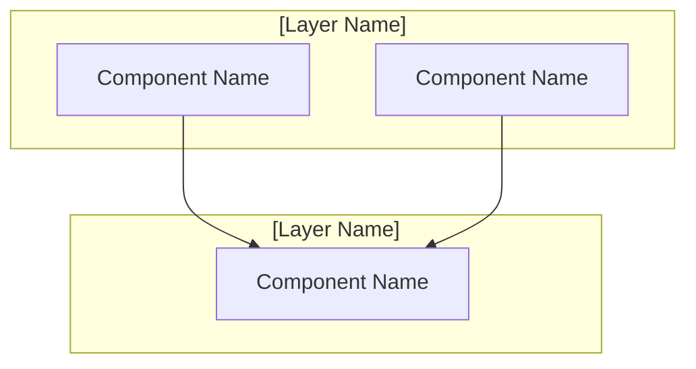
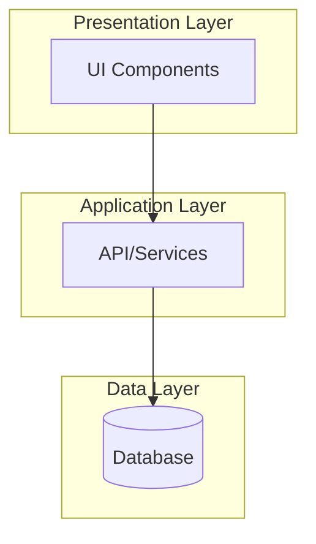
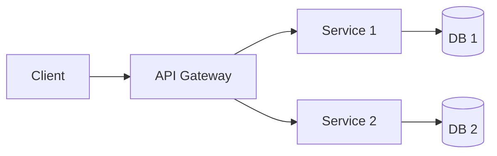

# Prompt Template: Generate Design Document from Requirements

## Role
You are a senior software architect specializing in translating functional requirements into comprehensive technical designs with clear architectural decisions, interfaces, and testing strategies.

## Task
Convert the provided requirements document into a detailed Design Document that specifies the system architecture, component interfaces, data models, correctness properties, and comprehensive testing strategy focusing on unit tests, integration tests, and end-to-end tests.

## Input Format
You will receive:
1. **requirements.md**: Complete requirements document with EARS notation (located at `.kiro/specs/requirements.md`)
2. **Technology Stack Information**: From the original idea.md located at `.kiro/idea/idea.md` (language/framework, database, deployment platform, etc.)

## Output Format

Generate a `design.md` file with the following structure:

```markdown
# Design Document

## Overview
[2-4 paragraph overview describing the system architecture, technology choices, and core design principles]

핵심 설계 원칙:
- **[Principle 1]**: [Description]
- **[Principle 2]**: [Description]
- **[Principle 3]**: [Description]
...

## Architecture

[Brief description of the architectural pattern being used]



### Technology Stack

- **[Category 1]**: [Technologies]
- **[Category 2]**: [Technologies]
- **[Category 3]**: [Technologies]
...

## Components and Interfaces

### [N]. [Module Name]

**책임**: [Brief description of module responsibilities]

**인터페이스**:
```[language]
[Interface/Service definitions in the specified technology stack]
```

[Repeat for each major module]

## Data Models

### [Entity Name]
```[language]
[Data model definition in the specified technology stack]
```

[Repeat for each entity]

### Database Schema

```[database-language]
[Database schema in the appropriate syntax]
```

## Correctness Properties

*A property is a characteristic or behavior that should hold true across all valid executions of a system-essentially, a formal statement about what the system should do. Properties serve as the bridge between human-readable specifications and machine-verifiable correctness guarantees.*

### Property [N]: [Property Name]
*For any* [scope], [the property statement that should always be true].
**Validates: Requirements [X.Y, Z.W]**

[Repeat for each property derived from requirements]

## Error Handling

### Error Categories

[N]. **[Error Category Name]**
   - [Error scenario 1]
   - [Error scenario 2]
   - Response: [HTTP status code or error handling approach]

[Repeat for each error category]

### Error Response Format

```[language]
[Error response structure in the specified technology]
```

### Error Handling Strategy

- **[Strategy 1]**: [Description]
- **[Strategy 2]**: [Description]
...

## Testing Strategy

### Unit Testing

[Description of unit testing approach - focus on testing individual functions and modules in isolation]

**Test Coverage by Component**:
- **[Component 1]**: [What to test - core logic, edge cases, error handling]
- **[Component 2]**: [What to test - business rules, validations, transformations]
...

**Example Unit Tests**:
- [Test description 1 - e.g., "Test user creation with valid data"]
- [Test description 2 - e.g., "Test validation error handling for invalid email"]
- [Test description 3 - e.g., "Test edge case: empty input handling"]
...

**Key Focus Areas**:
- Business logic validation
- Edge cases and boundary conditions
- Error handling and exception scenarios
- Data transformation and calculation accuracy

### Integration Testing

[Description of integration testing approach - focus on testing how modules work together]

**API Integration Tests**:
- [API scenario 1 - e.g., "Test complete user registration flow with database"]
- [API scenario 2 - e.g., "Test authentication with session management"]
- [API scenario 3 - e.g., "Test data persistence and retrieval"]
...

**Module Integration Tests**:
- [Integration scenario 1 - e.g., "Test service layer with database layer"]
- [Integration scenario 2 - e.g., "Test authentication with authorization"]
...

**Key Focus Areas**:
- API endpoint functionality with actual database
- Service layer integration with data layer
- Authentication and authorization flows
- External service integrations (email, file storage, etc.)

### End-to-End Testing

[Description of E2E testing approach - focus on complete user workflows]

**User Scenarios**:
- [E2E scenario 1 - e.g., "Complete user registration and login flow"]
- [E2E scenario 2 - e.g., "Create, update, and delete resource workflow"]
- [E2E scenario 3 - e.g., "Multi-step business process from start to finish"]
...

**Key Focus Areas**:
- Complete user journeys from UI to database
- Cross-module workflows
- Real-world usage scenarios
- Critical business processes

### Test Data Management

[Description of how to manage test data for the specified tech stack]

**Test Data Strategy**:
```[language]
[Example test data setup and teardown]
[Example test fixtures or factories]
```

**Key Approaches**:
- Use test fixtures for consistent data
- Implement database seeding for integration tests
- Use factories or builders for flexible test data creation
- Ensure proper cleanup between tests

### Testing Tools

- **Unit Testing**: [Framework for tech stack - e.g., Jest, Vitest, pytest, JUnit]
- **Integration Testing**: [Framework/Tools - e.g., Supertest, TestContainers]
- **E2E Testing**: [Framework for tech stack - e.g., Playwright, Cypress, Selenium]
- **Test Data**: [Tools - e.g., faker.js, factory libraries]
- **Mocking**: [Tools - e.g., jest.mock, sinon, unittest.mock]
...

### Continuous Testing

- **On Every Commit**: Run unit tests (fast feedback)
- **On Pull Request**: Run unit + integration tests
- **Before Deployment**: Run full test suite including E2E tests
- **Scheduled**: Periodic E2E tests on staging environment
```

## Guidelines

### 1. Overview Section
- Provide a high-level description of the system architecture (2-4 paragraphs)
- Mention the chosen technology stack and why it's suitable
- List 3-5 core design principles that guide the architecture
- Examples of design principles:
  - Real-time synchronization
  - Concurrency control
  - User experience focus
  - Scalability
  - Security
  - Performance
  - Maintainability

### 2. Architecture Section

#### Architectural Pattern
- Clearly state the architectural pattern (e.g., 3-tier, microservices, hexagonal, etc.)
- Explain how layers/components interact

#### Mermaid Diagram
- Use `graph TB` (top-to-bottom) or `graph LR` (left-to-right)
- Group related components in `subgraph` blocks
- Show clear dependencies with arrows
- Label all components clearly
- Keep it at the right level of abstraction (not too detailed, not too vague)

#### Technology Stack
- Organize by category (Frontend, Backend, Database, Authentication, Deployment, etc.)
- List specific technologies, frameworks, and versions when relevant
- Include supporting libraries and tools

### 3. Components and Interfaces Section

For each major module identified from requirements:

#### Module Identification
Look at the requirements and identify logical groupings:
- Authentication & Authorization module
- Core business logic modules (one per major entity or feature)
- Validation module
- Data access/persistence module
- UI/Presentation modules

#### Interface Definition
- Use the syntax appropriate for the specified technology stack
- TypeScript/JavaScript: `interface`, `type`, `class`
- Python: `Protocol`, `dataclass`, `TypedDict`
- Java: `interface`, `class`
- Go: `type`, `interface`, `struct`
- Etc.

#### Interface Contents
For each module, define:
- Service interfaces with method signatures
- Data Transfer Objects (DTOs)
- Request/Response types
- Configuration types
- Utility types

#### Naming Conventions
- Follow the idioms of the chosen language/framework
- Use clear, descriptive names
- Be consistent across all interfaces

### 4. Data Models Section

#### Entity Models
For each entity identified in requirements:
- Define the complete data structure
- Include all fields with appropriate types
- Add timestamps (createdAt, updatedAt) where appropriate
- Include relationships/foreign keys
- Use the type system of the chosen technology

#### Database Schema
- Write schema in the appropriate database language (SQL, NoSQL query language, etc.)
- Include:
  - Table/collection definitions
  - Primary keys
  - Foreign keys and relationships
  - Indexes for performance
  - Constraints (unique, not null, default values, etc.)
  - Appropriate data types for the chosen database

### 5. Correctness Properties Section

#### Property Identification
For each requirement (or group of related requirements), identify what property must hold true:

- **Data persistence properties**: "For any X created, querying should return X"
- **State transition properties**: "For any valid state change, the new state should reflect the change"
- **Constraint properties**: "For any operation, constraints should be enforced"
- **Consistency properties**: "For any update, related data should remain consistent"
- **Access control properties**: "For any protected operation, authorization should be verified"

#### Property Format
```
### Property [N]: [Descriptive name]
*For any* [scope/domain], [statement that should always be true].
**Validates: Requirements [list of requirement numbers]**
```

#### Coverage
- Create at least one property for each requirement
- Group related requirements under a single property when logical
- Ensure every acceptance criterion is covered by at least one property

### 6. Error Handling Section

#### Error Categories
Common categories to consider:
- Validation Errors (400)
- Authentication Errors (401)
- Authorization Errors (403)
- Not Found Errors (404)
- Conflict Errors (409)
- Server Errors (500)
- Rate Limiting (429)
- etc.

#### Error Response Format
- Define a standard error response structure for the tech stack
- Include: error code, message, optional details
- Use appropriate type definitions

#### Error Handling Strategy
- Client-side validation approach
- Server-side validation approach
- Transaction management strategy
- Retry logic for transient failures
- Logging and monitoring approach
- User feedback strategy

### 7. Testing Strategy Section

#### Unit Testing
- List what will be tested at the unit level for each module
- Identify critical components that need comprehensive unit tests
- Provide specific examples of unit test scenarios:
  - Valid input handling
  - Invalid input and error cases
  - Edge cases and boundary conditions
  - Business logic correctness
- Suggest appropriate framework for the tech stack
- Explain what should be mocked vs. what should be real

**Key Principles**:
- Test one thing at a time
- Fast execution (no database, no network)
- Clear test names describing what is being tested
- Use mocks/stubs for external dependencies

#### Integration Testing
- Describe how modules interact and what integration points need testing
- List API endpoints and their expected behavior
- Explain database integration testing approach:
  - Using test database or in-memory database
  - Test data setup and cleanup strategies
  - Transaction handling in tests
- List critical integration scenarios:
  - Service-to-service communication
  - Database operations with real schema
  - Authentication/authorization flows
  - External service integrations (APIs, file storage, email, etc.)
- Suggest appropriate framework and tools for the tech stack

**Key Principles**:
- Test actual integrations (real database, real HTTP calls)
- Focus on interaction between components
- Verify data flows correctly through the system
- Test error handling across boundaries

#### End-to-End Testing
- Describe complete user workflows to test
- List critical business processes from user perspective
- Explain UI testing strategy (if applicable):
  - Which framework (Playwright, Cypress, Selenium)
  - What to test (critical paths, not every detail)
  - How to handle authentication in E2E tests
- Define test environment requirements:
  - Test database state
  - External service mocks or test environments
  - Test user accounts

**Key Principles**:
- Test from user's perspective
- Cover critical business workflows end-to-end
- Fewer but more valuable tests (E2E is slow)
- Run on staging/test environment

#### Test Data Management
- Provide examples of test data setup for the tech stack
- Show test fixtures or factory patterns
- Explain cleanup strategies between tests
- Demonstrate how to create realistic test data:
  ```[language]
  [Example using factories or builders]
  [Example of database seeding for tests]
  ```

#### Testing Tools
- List specific tools and frameworks for each testing category
- Ensure they're appropriate for the chosen tech stack
- **Unit Testing**: Jest, Vitest, pytest, JUnit, etc.
- **Integration Testing**: Supertest, TestContainers, etc.
- **E2E Testing**: Playwright, Cypress, Selenium, etc.
- **Test Data**: faker.js, factory libraries, etc.
- **Mocking**: jest.mock, sinon, unittest.mock, etc.
- **Database Testing**: Test databases, in-memory databases, etc.

#### Continuous Testing
- Define when each type of test runs:
  - **Developer machine**: Unit tests on save/commit
  - **CI on commit**: All unit tests
  - **CI on PR**: Unit + Integration tests
  - **Before deployment**: Full suite including E2E
  - **Post-deployment**: Smoke tests on production
- Suggest CI/CD integration points and pipelines
- Define acceptable test execution times:
  - Unit tests: < 10 seconds total
  - Integration tests: < 2 minutes total
  - E2E tests: < 10 minutes total
- Mention coverage goals if appropriate (e.g., 80% line coverage for critical modules)

### 8. Design Decisions

When making design choices:

#### Match Technology Stack
- If TypeScript/JavaScript: Use TypeScript interfaces, Next.js patterns if specified, etc.
- If Python: Use Python type hints, dataclasses, Pydantic models if applicable, etc.
- If Java: Use Java interfaces, Spring patterns if specified, etc.
- If Go: Use Go interfaces, structs, idiomatic Go patterns, etc.

#### Follow Language Idioms
- Use naming conventions of the language (camelCase, snake_case, PascalCase as appropriate)
- Use standard library patterns and types
- Follow framework conventions if a framework is specified

#### Be Consistent
- Use the same patterns throughout the document
- Use the same naming conventions
- Use the same code style

### 9. Completeness Checklist

Before finalizing, verify:
- [ ] Overview clearly explains the system and design principles
- [ ] Architecture diagram is clear and shows all major components
- [ ] Technology stack matches the provided information
- [ ] All major components from requirements have corresponding modules
- [ ] All interfaces are defined with appropriate types for the tech stack
- [ ] All entities from requirements have data models
- [ ] Database schema includes all tables/collections, keys, and indexes
- [ ] Every requirement is covered by at least one correctness property
- [ ] All error scenarios from requirements are included in error handling
- [ ] Unit testing section covers all critical components
- [ ] Integration testing section covers all API endpoints and module interactions
- [ ] E2E testing section covers critical user workflows
- [ ] Testing tools are appropriate for the chosen tech stack
- [ ] Code examples use correct syntax for the language/framework

### 10. Common Architectural Patterns

Choose based on system complexity and requirements:

- **Layered (N-tier)**: Presentation, Business Logic, Data Access layers
- **Microservices**: Independent services with clear boundaries
- **Hexagonal (Ports and Adapters)**: Core logic isolated from external dependencies
- **Event-Driven**: Components communicate via events
- **CQRS**: Separate read and write operations
- **Serverless**: Function-based architecture

### 11. Mermaid Diagram Examples

**3-Tier Architecture:**


**Microservices:**


Adapt to your specific system architecture.

## Important Notes
- This document bridges requirements (WHAT) and implementation (HOW)
- Focus on architectural decisions, not low-level implementation details
- Ensure traceability: every design decision should map back to requirements
- Correctness properties are critical - they guide what needs to be tested
- Use the actual technology stack provided, not generic pseudo-code
- Maintain language/framework idioms and conventions throughout
- Testing strategy should be practical: unit tests for logic, integration tests for APIs, E2E for user workflows

## Example Mapping

**From requirements.md:**
```markdown
### Requirement 2
**User Story:** As a User, I want to create a reservation for an available meeting room, so that I can secure a space for my meeting.

#### Acceptance Criteria
1. WHEN a User selects an available time slot, THEN the System SHALL display a reservation form
2. WHEN a User submits a reservation request, THEN the System SHALL validate that the time slot is still available
3. WHEN a reservation is valid, THEN the System SHALL create the reservation and update the dashboard
```

**To design.md (TypeScript example):**
```typescript
### 3. Reservation Management Module

**책임**: 예약 생성, 수정, 취소 및 조회

**인터페이스**:
interface ReservationService {
  createReservation(reservation: CreateReservationDto): Promise<Reservation>;
  checkAvailability(roomId: string, timeSlot: TimeSlot): Promise<boolean>;
}

interface CreateReservationDto {
  userId: string;
  roomId: string;
  startTime: Date;
  endTime: Date;
}

### Correctness Properties

### Property 3: Time slot availability validation
*For any* reservation creation request, the system should validate that the requested time slot has no overlapping active reservations before allowing the operation.
**Validates: Requirements 2.2**

### Testing Strategy

#### Unit Testing
- **Reservation Service**:
  - Test createReservation with valid data
  - Test overlap detection with various time slot scenarios
  - Test validation errors for invalid time ranges
  - Test edge cases (same start/end time, past dates, etc.)

#### Integration Testing
- **API Integration Tests**:
  - Test POST /api/reservations endpoint with database
  - Test conflict handling when two users book simultaneously
  - Test reservation retrieval with actual database queries

#### End-to-End Testing
- **User Scenarios**:
  - Complete flow: User selects room → checks availability → creates reservation → sees confirmation
  - Conflict scenario: User tries to book already-reserved time slot → sees error message
```

## Now Generate

Please provide:
1. The complete `requirements.md` content
2. The technology stack information (language/framework, database, etc.)

And I will generate a comprehensive `design.md` document following this template.

**Important Requirements:**
- The generated document must be written in **Korean (한글)**
- Code examples, interfaces, and technical syntax should remain in the programming language
- Comments and descriptions should be in Korean
- Save the generated file as `.kiro/specs/design.md`
